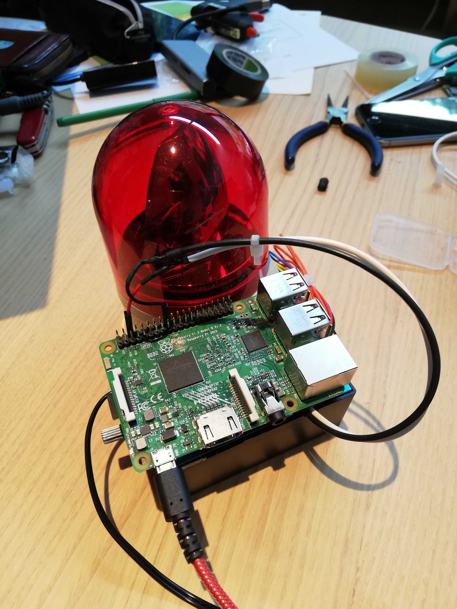

# Duel for backend
これはDuelのバックエンドプロジェクトです.  
DuelからのHTTPリクエストの受け口とパトランプを動作させる役割を果たしています.

...本当はBluetoothで接続したかったのですが, 度重なる不幸により諦めざるを得ませんでした.

### 動作環境

|||
|:--|:--|
|マシン|Raspberry Pi Zero WH|
|OS|Raspbian Stretch Lite(April 2019)|
|Webサーバ|nginx|
|PHP|PHP 7.0|
|Python|Python 3.5.3|

### ✝終焉を告げるPATRAMP✝
時間切れを通知する専用デバイスとして, 『終焉を告げるPATRAMP』を用意しました.

